# SPÉCIFICATIONS TECHNIQUES DE LA BASE DE DONNÉES STILOVA

Ce document présente l'architecture de base de données de production complète pour la plateforme **Stilova**. Il modélise un schéma relationnel robuste, hautement indexé et optimisé sous PostgreSQL 16 avec Prisma ORM.

---

## 1. DIAGRAMME DE RELATION DES ENTITÉS (ERD PROFÉSSIONNEL)

Voici la représentation des relations physiques de notre modèle PostgreSQL.

```mermaid
erDiagram
    users {
        UUID id PK
        VARCHAR email UK
        BOOLEAN email_verified
        VARCHAR password_hash
        UserStatus status
        TIMESTAMP last_login_at
        TIMESTAMP created_at
        TIMESTAMP updated_at
        TIMESTAMP deleted_at
    }

    profiles {
        UUID id PK
        UUID user_id FK, UK
        VARCHAR username UK
        VARCHAR display_name
        TEXT avatar_url
        TEXT banner_url
        TEXT bio
        VARCHAR country
        VARCHAR language
        TEXT website
        DATE birth_date
        TIMESTAMP created_at
        TIMESTAMP updated_at
    }

    privacy_settings {
        UUID user_id PK, FK
        BOOLEAN show_library
        BOOLEAN show_favorites
        BOOLEAN show_history
        BOOLEAN show_badges
        BOOLEAN show_following
        BOOLEAN show_comments
    }

    roles {
        UUID id PK
        VARCHAR name UK
        TEXT description
        TIMESTAMP created_at
        TIMESTAMP updated_at
    }

    permissions {
        UUID id PK
        VARCHAR code UK
        VARCHAR name
        VARCHAR module
        TEXT description
        TIMESTAMP created_at
        TIMESTAMP updated_at
    }

    role_permissions {
        UUID role_id PK, FK
        UUID permission_id PK, FK
    }

    user_roles {
        UUID user_id PK, FK
        UUID role_id PK, FK
        UUID assigned_by FK
        TIMESTAMP assigned_at
    }

    follows {
        UUID follower_id PK, FK
        UUID following_id PK, FK
        TIMESTAMP created_at
    }

    badges {
        UUID id PK
        VARCHAR name UK
        TEXT description
        TEXT icon
        VARCHAR category
        TIMESTAMP created_at
        TIMESTAMP updated_at
    }

    user_badges {
        UUID user_id PK, FK
        UUID badge_id PK, FK
        TIMESTAMP awarded_at
    }

    universes {
        UUID id PK
        UUID owner_id FK
        VARCHAR title
        VARCHAR slug UK
        TEXT description
        TEXT cover_url
        TIMESTAMP created_at
        TIMESTAMP updated_at
        TIMESTAMP deleted_at
    }

    stories {
        UUID id PK
        UUID author_id FK
        UUID universe_id FK
        VARCHAR title
        VARCHAR slug UK
        TEXT summary
        TEXT cover_url
        TEXT banner_url
        VARCHAR language
        StoryStatus status
        BOOLEAN downloads_allowed
        BOOLEAN interactive
        TIMESTAMP published_at
        TIMESTAMP created_at
        TIMESTAMP updated_at
        TIMESTAMP deleted_at
    }

    categories {
        UUID id PK
        VARCHAR name UK
        VARCHAR slug UK
        TIMESTAMP created_at
    }

    tags {
        UUID id PK
        VARCHAR name UK
        VARCHAR slug UK
        TIMESTAMP created_at
    }

    story_tags {
        UUID story_id PK, FK
        UUID tag_id PK, FK
    }

    story_categories {
        UUID story_id PK, FK
        UUID category_id PK, FK
    }

    chapters {
        UUID id PK
        UUID story_id FK
        VARCHAR title
        INTEGER chapter_number
        ChapterStatus status
        INTEGER word_count
        TIMESTAMP published_at
        TIMESTAMP created_at
        TIMESTAMP updated_at
        TIMESTAMP deleted_at
    }

    chapter_blocks {
        UUID id PK
        UUID chapter_id FK
        BlockType type
        INTEGER position
        TEXT content
        JSONB metadata
        TIMESTAMP created_at
        TIMESTAMP updated_at
    }

    choices {
        UUID id PK
        UUID block_id FK
        VARCHAR label
        UUID next_chapter_id FK
        TIMESTAMP created_at
        TIMESTAMP updated_at
    }

    comments {
        UUID id PK
        UUID chapter_id FK
        UUID user_id FK
        UUID parent_id FK
        TEXT content
        CommentStatus status
        TIMESTAMP created_at
        TIMESTAMP updated_at
        TIMESTAMP deleted_at
    }

    comment_likes {
        UUID comment_id PK, FK
        UUID user_id PK, FK
        TIMESTAMP created_at
    }

    story_likes {
        UUID story_id PK, FK
        UUID user_id PK, FK
        TIMESTAMP created_at
    }

    story_ratings {
        UUID story_id PK, FK
        UUID user_id PK, FK
        INTEGER rating
        TIMESTAMP created_at
    }

    libraries {
        UUID id PK
        UUID user_id FK
        UUID story_id FK
        LibraryStatus status
        TIMESTAMP created_at
        TIMESTAMP updated_at
    }

    bookmarks {
        UUID id PK
        UUID user_id FK
        UUID chapter_id FK
        DOUBLE_PRECISION position
        TEXT note
        TIMESTAMP created_at
        TIMESTAMP updated_at
    }

    reading_history {
        UUID id PK
        UUID user_id FK
        UUID story_id FK
        UUID chapter_id FK
        DOUBLE_PRECISION progress
        TIMESTAMP last_read_at
    }

    offline_downloads {
        UUID id PK
        UUID user_id FK
        UUID story_id FK
        TIMESTAMP downloaded_at
        TIMESTAMP expires_at
    }

    notifications {
        UUID id PK
        UUID user_id FK
        VARCHAR type
        VARCHAR title
        TEXT body
        JSONB payload
        TIMESTAMP read_at
        TIMESTAMP created_at
    }

    contests {
        UUID id PK
        VARCHAR title
        TEXT description
        TEXT rules
        TEXT reward
        TIMESTAMP start_date
        TIMESTAMP end_date
        ContestStatus status
        TIMESTAMP created_at
        TIMESTAMP updated_at
        TIMESTAMP deleted_at
    }

    contest_submissions {
        UUID id PK
        UUID contest_id FK
        UUID story_id FK
        UUID submitted_by FK
        TIMESTAMP submitted_at
        SubmissionStatus status
    }

    reports {
        UUID id PK
        UUID reporter_id FK
        VARCHAR target_type
        UUID target_id
        TEXT reason
        ReportStatus status
        UUID reviewed_by FK
        TIMESTAMP reviewed_at
        TIMESTAMP created_at
    }

    ai_generations {
        UUID id PK
        UUID user_id FK
        AIGenFeature feature
        VARCHAR provider
        TEXT prompt
        INTEGER tokens_used
        DECIMAL cost
        TIMESTAMP created_at
    }

    admin_logs {
        UUID id PK
        UUID admin_id FK
        VARCHAR action
        VARCHAR target_type
        UUID target_id
        JSONB metadata
        TIMESTAMP created_at
    }

    %% Relations Definitions
    users ||--|| profiles : "possède un"
    users ||--|| privacy_settings : "paramètre"
    roles ||--o{ role_permissions : "contient"
    permissions ||--o{ role_permissions : "référencé par"
    users ||--o{ user_roles : "reçoit"
    roles ||--o{ user_roles : "assigné par"
    users ||--o{ follows : "suit / est suivi"
    users ||--o{ user_badges : "reçoit"
    badges ||--o{ user_badges : "octroie"
    users ||--o{ universes : "possède"
    users ||--o{ stories : "écrit"
    universes ||--o{ stories : "contient"
    stories ||--o{ story_tags : "possède"
    tags ||--o{ story_tags : "référencé par"
    stories ||--o{ story_categories : "appartient à"
    categories ||--o{ story_categories : "contient"
    stories ||--o{ chapters : "contient"
    chapters ||--o{ chapter_blocks : "contient"
    chapter_blocks ||--o{ choices : "possède"
    chapters ||--o{ choices : "mène à"
    chapters ||--o{ comments : "contient"
    users ||--o{ comments : "rédige"
    comments ||--o{ comment_likes : "reçoit"
    users ||--o{ comment_likes : "aime"
    stories ||--o{ story_likes : "reçoit"
    users ||--o{ story_likes : "aime"
    stories ||--o{ story_ratings : "reçoit"
    users ||--o{ story_ratings : "note"
    users ||--o{ libraries : "possède"
    stories ||--o{ libraries : "ajoutée à"
    users ||--o{ bookmarks : "crée"
    chapters ||--o{ bookmarks : "référence"
    users ||--o{ reading_history : "consulte"
    stories ||--o{ reading_history : "historisé à"
    users ||--o{ offline_downloads : "télécharge"
    stories ||--o{ offline_downloads : "sauvegardée à"
    users ||--o{ notifications : "reçoit"
    contests ||--o{ contest_submissions : "reçoit"
    stories ||--o{ contest_submissions : "soumise à"
    users ||--o{ contest_submissions : "soumise par"
    users ||--o{ reports : "signale"
    users ||--o{ ai_generations : "demande"
    users ||--o{ admin_logs : "historise"
```



---

## 2. DESCRIPTION DÉTAILLÉE DES RELATIONS

1. **Relation `users` (1) ── (1) `profiles`**
   - Politique physique : `ON DELETE CASCADE` pour supprimer instantanément le profil si l'utilisateur supprime définitivement son compte.
2. **Relation `users` (1) ── (1) `privacy_settings`**
   - Politique physique : `ON DELETE CASCADE`. Les préférences de confidentialité sont créées automatiquement dès l'onboarding et durent aussi longtemps que le compte utilisateur est actif.
3. **Relation `users` (1) ── (N) `stories`**
   - Politique physique : `ON DELETE CASCADE`. Si un compte auteur est supprimé définitivement, ses histoires associées doivent disparaître de la visibilité publique, ou être archivées selon la stratégie de soft-delete.
4. **Relation `universes` (1) ── (N) `stories`**
   - Politique physique : `ON DELETE SET NULL`. En cas d'archivage ou suppression d'un Univers thématique, les histoires ne sont pas supprimées, elles redeviennent de simples romans orphelins (clés étrangères `universe_id` positionnées à `NULL`).
5. **Relation `stories` (1) ── (N) `chapters`**
   - Politique physique : `ON DELETE CASCADE`. Si le roman est supprimé, ses chapitres de texte associés sont détruits en cascade.
6. **Relation `chapters` (1) ── (N) `chapter_blocks`**
   - Politique physique : `ON DELETE CASCADE`. Les blocs constitutifs d'un chapitre n'ont aucune autonomie sémantique hors de leur chapitre respectif.
7. **Relation `chapter_blocks` (1) ── (N) `choices`**
   - Politique physique : `ON DELETE CASCADE`. Si un bloc de type `CHOICE` disparait, les embranchements de récits associés sont également purgés.
8. **Relation `chapters` (1) ── (N) `choices` (Cible)**
   - Politique physique : `ON DELETE RESTRICT` ou `ON DELETE SET NULL` pour empêcher qu'un chapitre cible d'une traversée interactive (Next Chapter) soit accidentellement détruit s'il reste d'autres embranchements actifs pointant vers lui.
9. **Relation `comments` (1) ── (N) `comments` (Self-relation parent/replies)**
   - Politique physique : `ON DELETE CASCADE`. Supprimer ou masquer un commentaire d'origine parent applique automatiquement la disparition en cascade de ses réponses imbriquées.
10. **Abonnements (`follows`) & Droits (`role_permissions`, `user_roles`, `user_badges`, `story_tags`, `story_categories`)**
    - Identités de jointures (Many-To-Many) qui utilisent des clés composites uniques avec `ON DELETE CASCADE` sur les deux pivots clés.

---

## 3. SCHÉMA PRISMA DE PRODUCTION COMPLET

Voici le fichier complet `schema.prisma` prêt à être compilé par le moteur Prisma :

```prisma
// schema.prisma
// Base de données de production pour STILOVA

datasource db {
  provider = "postgresql"
  url      = env("DATABASE_URL")
}

generator client {
  provider = "prisma-client-js"
}

/// Statuts du cycle de vie du compte d'un utilisateur
enum UserStatus {
  ACTIVE
  PENDING_VERIFICATION
  SUSPENDED
  BANNED
  DELETED
}

/// Statuts de publication d'une histoire
enum StoryStatus {
  DRAFT
  PUBLISHED
  ARCHIVED
}

/// Statuts de modération ou d'édition d'un chapitre
enum ChapterStatus {
  DRAFT
  PUBLISHED
  ARCHIVED
}

/// Format de bloc d'écriture Notion-style dans l'éditeur
enum BlockType {
  TEXT
  IMAGE
  QUOTE
  SEPARATOR
  AI_IMAGE
  CHOICE
}

/// Statuts de lecture et de sauvegarde dans la bibliothèque personnelle
enum LibraryStatus {
  READING
  TO_READ
  COMPLETED
  FAVORITE
}

/// Statuts de cycle de vie d'un concours d'écriture panafricain
enum ContestStatus {
  UPCOMING
  OPEN
  VOTING
  CLOSED
  ARCHIVED
}

/// Statuts de validation d'un texte soumis à un concours
enum SubmissionStatus {
  PENDING
  APPROVED
  REJECTED
}

/// Types de cibles de signalements de modération
enum ReportTargetType {
  STORY
  CHAPTER
  COMMENT
  USER
}

/// Statuts de workflow pour le traitement des litiges
enum ReportStatus {
  PENDING
  UNDER_REVIEW
  DISMISSED
  ACTION_TAKEN
}

/// Catégorisation des requêtes émises vers l'assistant IA Gemini
enum AIGenFeature {
  CORRECTION
  SUMMARY
  CHARACTERS
  TIMELINE
  ILLUSTRATION
  SUGGESTIONS
}

/// Table racine contenant les données d'authentification et de sécurité
model User {
  id              String           @id @default(uuid())
  email           String           @unique
  emailVerified   Boolean          @default(false)
  passwordHash    String
  status          UserStatus       @default(ACTIVE)
  lastLoginAt     DateTime?
  twoFactorSecret String?
  is2FAEnabled    Boolean          @default(false)
  createdAt       DateTime         @default(now())
  updatedAt       DateTime         @updatedAt
  deletedAt       DateTime?

  // Relations 1:1
  profile         Profile?
  privacySettings PrivacySettings?

  // Relations 1:N
  userRoles       UserRole[]
  followsCreated  Follow[]         @relation("FollowerRelation")
  followsReceived Follow[]         @relation("FollowingRelation")
  userBadges      UserBadge[]
  universes       Universe[]
  stories         Story[]
  comments        Comment[]
  commentLikes    CommentLike[]
  storyLikes      StoryLike[]
  storyRatings    StoryRating[]
  libraries       Library[]
  bookmarks       Bookmark[]
  readingHistory  ReadingHistory[]
  downloads       OfflineDownload[]
  submissions     ContestSubmission[]
  reportsFiled    Report[]         @relation("ReporterRelation")
  reportsReviewed Report[]         @relation("ReviewerRelation")
  aiGenerations   AIGeneration[]
  adminLogs       AdminLog[]

  @@index([email])
  @@index([status])
}

/// Profil d'identité publique d'un lecteur ou auteur (Griot)
model Profile {
  id          String   @id @default(uuid())
  userId      String   @unique
  username    String   @unique
  displayName String
  avatarUrl   String?
  bannerUrl   String?
  bio         String?  @db.Text
  country     String?
  language    String   @default("fr")
  website     String?
  birthDate   DateTime?
  createdAt   DateTime @default(now())
  updatedAt   DateTime @updatedAt

  user        User     @relation(fields: [userId], references: [id], onDelete: Cascade)
}

/// Configuration fine de confidentialité d'accès aux collections de données
model PrivacySettings {
  userId         String  @id
  showLibrary    Boolean @default(false)
  showFavorites  Boolean @default(false)
  showHistory    Boolean @default(false)
  showBadges     Boolean @default(true)
  showFollowing  Boolean @default(true)
  showComments   Boolean @default(true)

  user           User    @relation(fields: [userId], references: [id], onDelete: Cascade)
}

/// Rôles d'autorisation RBAC de base
model Role {
  id              String           @id @default(uuid())
  name            String           @unique
  description     String?          @db.Text
  createdAt       DateTime         @default(now())
  updatedAt       DateTime         @updatedAt

  rolePermissions RolePermission[]
  userRoles       UserRole[]
}

/// Permissions d'autorisations fines d'interactions applicatives
model Permission {
  id              String           @id @default(uuid())
  code            String           @unique
  name            String
  module          String
  description     String?          @db.Text
  createdAt       DateTime         @default(now())
  updatedAt       DateTime         @updatedAt

  rolePermissions RolePermission[]
}

/// Relation pivot de jointure Many-To-Many unissant Roles et Permissions
model RolePermission {
  roleId       String
  permissionId String

  role         Role       @relation(fields: [roleId], references: [id], onDelete: Cascade)
  permission   Permission @relation(fields: [permissionId], references: [id], onDelete: Cascade)

  @@id([roleId, permissionId])
}

/// Association dynamique de rôles aux utilisateurs
model UserRole {
  userId     String
  roleId     String
  assignedBy String?
  assignedAt DateTime @default(now())

  user       User     @relation(fields: [userId], references: [id], onDelete: Cascade)
  role       Role     @relation(fields: [roleId], references: [id], onDelete: Cascade)

  @@id([userId, roleId])
}

/// Suivis inter-utilisateurs (Abonnements d'auteurs ou de lecteurs)
model Follow {
  followerId  String
  followingId String
  createdAt   DateTime @default(now())

  follower    User     @relation("FollowerRelation", fields: [followerId], references: [id], onDelete: Cascade)
  following   User     @relation("FollowingRelation", fields: [followingId], references: [id], onDelete: Cascade)

  @@id([followerId, followingId])
}

/// Distinction ou Badge d'engagement reçu suite à un accomplissement ludique (Gamification)
model Badge {
  id          String      @id @default(uuid())
  name        String      @unique
  description String      @db.Text
  icon        String
  category    String
  createdAt   DateTime    @default(now())
  updatedAt   DateTime    @updatedAt

  userBadges  UserBadge[]
}

/// Table d'attribution des badges déverrouillés par les utilisateurs
model UserBadge {
  userId    String
  badgeId   String
  awardedAt DateTime @default(now())

  user      User     @relation(fields: [userId], references: [id], onDelete: Cascade)
  badge     Badge    @relation(fields: [badgeId], references: [id], onDelete: Cascade)

  @@id([userId, badgeId])
}

/// Meta-univers unissant une saga littéraire, un ensemble de royaumes ou des chronologies croisées
model Universe {
  id          String    @id @default(uuid())
  ownerId     String
  title       String
  slug        String    @unique
  description String    @db.Text
  coverUrl    String?
  createdAt   DateTime  @default(now())
  updatedAt   DateTime  @updatedAt
  deletedAt   DateTime?

  owner       User      @relation(fields: [ownerId], references: [id], onDelete: Cascade)
  stories     Story[]

  @@index([ownerId])
}

/// Fiche maîtresse d'une œuvre littéraire ou d'un livre d'aventure interactif
model Story {
  id               String              @id @default(uuid())
  authorId         String
  universeId       String?
  title            String
  slug             String              @unique
  summary          String              @db.Text
  coverUrl         String?
  bannerUrl        String?
  language         String              @default("fr")
  status           StoryStatus         @default(DRAFT)
  downloadsAllowed Boolean             @default(true)
  interactive      Boolean             @default(false)
  publishedAt      DateTime?
  createdAt        DateTime            @default(now())
  updatedAt        DateTime            @updatedAt
  deletedAt        DateTime?

  // Relations de parentés
  author           User                @relation(fields: [authorId], references: [id], onDelete: Cascade)
  universe         Universe?           @relation(fields: [universeId], references: [id], onDelete: SetNull)
  
  // Collections dépendantes
  chapters         Chapter[]
  storyTags        StoryTag[]
  storyCategories  StoryCategory[]
  comments         Comment[]
  likes            StoryLike[]
  ratings          StoryRating[]
  libraries        Library[]
  readingHistory   ReadingHistory[]
  downloads        OfflineDownload[]
  submissions      ContestSubmission[]

  @@index([authorId])
  @@index([status])
  @@index([publishedAt])
}

/// Catégorie éditoriale parente (ex : Romance, Afrofuturisme, Fantastique)
model Category {
  id              String          @id @default(uuid())
  name            String          @unique
  slug            String          @unique
  createdAt       DateTime        @default(now())

  storyCategories StoryCategory[]
}

/// Mots-clés libres et tags de recherche définis par les auteurs
model Tag {
  id        String     @id @default(uuid())
  name      String     @unique
  slug      String     @unique
  createdAt DateTime   @default(now())

  storyTags StoryTag[]
}

/// Table d'association Many-To-Many unissant tag et roman
model StoryTag {
  storyId String
  tagId   String

  story   Story  @relation(fields: [storyId], references: [id], onDelete: Cascade)
  tag     Tag    @relation(fields: [tagId], references: [id], onDelete: Cascade)

  @@id([storyId, tagId])
}

/// Table d'association Many-To-Many unissant catégorie et roman
model StoryCategory {
  storyId    String
  categoryId String

  story      Story    @relation(fields: [storyId], references: [id], onDelete: Cascade)
  category   Category @relation(fields: [categoryId], references: [id], onDelete: Cascade)

  @@id([storyId, categoryId])
}

/// Chapitre textuel d'un récit ou nœud de décision dans un parcours d'aventure
model Chapter {
  id            String         @id @default(uuid())
  storyId       String
  title         String
  chapterNumber Int
  status        ChapterStatus  @default(DRAFT)
  wordCount     Int            @default(0)
  publishedAt   DateTime?
  createdAt     DateTime       @default(now())
  updatedAt     DateTime       @updatedAt
  deletedAt     DateTime?

  story         Story          @relation(fields: [storyId], references: [id], onDelete: Cascade)
  blocks        ChapterBlock[]
  comments      Comment[]
  bookmarks     Bookmark[]
  readingHistory ReadingHistory[]
  choicesTarget Choice[]       @relation("ChoiceDestinationChapter")

  @@unique([storyId, chapterNumber])
  @@index([storyId])
}

/// Blocs typés constituants de l'Éditeur Notion-style de Stilova
model ChapterBlock {
  id             String    @id @default(uuid())
  chapterId      String
  type           BlockType @default(TEXT)
  position       Int
  content        String    @db.Text
  metadata       Json? // Permet de stocker les styles d'images, de citation ou configurations IA additionnelles
  createdAt      DateTime  @default(now())
  updatedAt      DateTime  @updatedAt

  chapter        Chapter   @relation(fields: [chapterId], references: [id], onDelete: Cascade)
  choices        Choice[]  @relation("ChoiceSourceBlock")

  @@index([chapterId])
}

/// Choix ou connecteurs logiques de récits interactifs non-linéaires
model Choice {
  id            String   @id @default(uuid())
  blockId       String
  label         String
  nextChapterId String
  createdAt     DateTime @default(now())
  updatedAt     DateTime @updatedAt

  block         ChapterBlock @relation("ChoiceSourceBlock", fields: [blockId], references: [id], onDelete: Cascade)
  nextChapter   Chapter      @relation("ChoiceDestinationChapter", fields: [nextChapterId], references: [id], onDelete: Cascade)

  @@index([blockId])
}

/// Commentaires de critiques, de retours de lecture ou d'échanges
model Comment {
  id        String        @id @default(uuid())
  chapterId String
  userId    String
  parentId  String?
  content   String        @db.Text
  status    String        @default("APPROVED") // ex : "APPROVED", "PENDING_MODERATION", "FLAGGED", "HIDDEN"
  createdAt DateTime      @default(now())
  updatedAt DateTime      @updatedAt
  deletedAt DateTime?

  chapter   Chapter       @relation(fields: [chapterId], references: [id], onDelete: Cascade)
  user      User          @relation(fields: [userId], references: [id], onDelete: Cascade)
  parent    Comment?      @relation("CommentThread", fields: [parentId], references: [id], onDelete: Cascade)
  replies   Comment[]     @relation("CommentThread")
  likes     CommentLike[]

  @@index([chapterId])
}

/// J'aime attribués aux commentaires pour le calcul d'utilité et de visibilité
model CommentLike {
  commentId String
  userId    String
  createdAt DateTime @default(now())

  comment   Comment  @relation(fields: [commentId], references: [id], onDelete: Cascade)
  user      User     @relation(fields: [userId], references: [id], onDelete: Cascade)

  @@id([commentId, userId])
}

/// Mentions "J'aime" d'histoires pour alimenter l'algorithme de découverte
model StoryLike {
  storyId   String
  userId    String
  createdAt DateTime @default(now())

  story     Story    @relation(fields: [storyId], references: [id], onDelete: Cascade)
  user      User     @relation(fields: [userId], references: [id], onDelete: Cascade)

  @@id([storyId, userId])
}

/// Notation d'œuvres sous forme de 1 à 5 plumes
model StoryRating {
  storyId   String
  userId    String
  rating    Int
  createdAt DateTime @default(now())

  story     Story    @relation(fields: [storyId], references: [id], onDelete: Cascade)
  user      User     @relation(fields: [userId], references: [id], onDelete: Cascade)

  @@id([storyId, userId])
}

/// Étagère ou bibliothèque personnelle des lecteurs
model Library {
  id        String        @id @default(uuid())
  userId    String
  storyId   String
  status    LibraryStatus @default(READING)
  createdAt DateTime      @default(now())
  updatedAt DateTime      @updatedAt

  user      User          @relation(fields: [userId], references: [id], onDelete: Cascade)
  story     Story         @relation(fields: [storyId], references: [id], onDelete: Cascade)

  @@unique([userId, storyId])
}

/// repères ou signets de lecture mémorisés avec ou sans prise de notes privées
model BookmarkedProgress {
  id        String   @id @default(uuid())
  userId    String
  chapterId String
  position  Float // Progression au sein du bloc ou coordonnée de défilement
  note      String?  @db.Text
  createdAt DateTime @default(now())
  updatedAt DateTime @updatedAt

  user      User     @relation(fields: [userId], references: [id], onDelete: Cascade)
  chapter   Chapter  @relation(fields: [chapterId], references: [id], onDelete: Cascade)

  @@index([userId])
}

/// Alias conservé de la structure demandée
model Bookmark {
  id        String   @id @default(uuid())
  userId    String
  storyId   String
  chapterId String
  position  Float    @default(0.0)
  note      String?  @db.Text
  createdAt DateTime @default(now())
  updatedAt DateTime @updatedAt

  user      User     @relation(fields: [userId], references: [id], onDelete: Cascade)
  story     Story    @relation(fields: [storyId], references: [id], onDelete: Cascade)
  chapter   Chapter  @relation(fields: [chapterId], references: [id], onDelete: Cascade)

  @@index([userId])
}

/// Journalisation chronologique de lecture (historique d'engagement)
model ReadingHistory {
  id         String   @id @default(uuid())
  userId     String
  storyId    String
  chapterId  String
  progress   Float    @default(0.0)
  lastReadAt DateTime @default(now())

  user       User     @relation(fields: [userId], references: [id], onDelete: Cascade)
  story      Story    @relation(fields: [storyId], references: [id], onDelete: Cascade)
  chapter    Chapter  @relation(fields: [chapterId], references: [id], onDelete: Cascade)

  @@unique([userId, storyId])
}

/// Téléchargements chiffrés locaux de récits prêts pour la lecture hors ligne
model OfflineDownload {
  id           String   @id @default(uuid())
  userId       String
  storyId      String
  downloadedAt DateTime @default(now())
  expiresAt    DateTime

  user         User     @relation(fields: [userId], references: [id], onDelete: Cascade)
  story        Story    @relation(fields: [storyId], references: [id], onDelete: Cascade)

  @@unique([userId, storyId])
}

/// Registre des notifications envoyées à l'utilisateur (Push et In-App)
model Notification {
  id        String    @id @default(uuid())
  userId    String
  type      String
  title     String
  body      String    @db.Text
  payload   Json?
  readAt    DateTime?
  createdAt DateTime  @default(now())

  user      User      @relation(fields: [userId], references: [id], onDelete: Cascade)

  @@index([userId])
  @@index([readAt])
}

/// Fiche descriptive d'un concours d'écriture de la communauté Stilova
model Contest {
  id          String              @id @default(uuid())
  title       String
  description String              @db.Text
  rules       String              @db.Text
  reward      String              @db.Text
  startDate   DateTime
  endDate     DateTime
  status      ContestStatus       @default(UPCOMING)
  createdAt   DateTime            @default(now())
  updatedAt   DateTime            @updatedAt
  deletedAt   DateTime?

  submissions ContestSubmission[]
}

/// Liaison de participation d'un roman à un concours actif
model ContestSubmission {
  id          String           @id @default(uuid())
  contestId   String
  storyId     String
  submittedBy String
  submittedAt DateTime         @default(now())
  status      SubmissionStatus @default(PENDING)

  contest     Contest          @relation(fields: [contestId], references: [id], onDelete: Cascade)
  story       Story            @relation(fields: [storyId], references: [id], onDelete: Cascade)
  user        User             @relation(fields: [submittedBy], references: [id], onDelete: Cascade)

  @@unique([contestId, storyId])
}

/// Dossier de signalement en vue d'un arbitrage de modération
model Report {
  id         String           @id @default(uuid())
  reporterId String
  targetType ReportTargetType
  targetId   String
  reason     String           @db.Text
  status     ReportStatus     @default(PENDING)
  reviewedBy String?
  reviewedAt DateTime?
  createdAt  DateTime         @default(now())

  reporter   User             @relation("ReporterRelation", fields: [reporterId], references: [id], onDelete: Cascade)
  reviewer   User?            @relation("ReviewerRelation", fields: [reviewedBy], references: [id], onDelete: SetNull)

  @@index([status])
  @@index([targetId])
}

/// Déclenchements et métriques des générations IA (Gemini API)
model AIGeneration {
  id         String       @id @default(uuid())
  userId     String
  feature    AIGenFeature
  provider   String       @default("google-gemini")
  prompt     String       @db.Text
  tokensUsed Int          @default(0)
  cost       Decimal      @db.Decimal(10, 5) @default(0.0)
  createdAt  DateTime     @default(now())

  user       User         @relation(fields: [userId], references: [id], onDelete: Cascade)
}

/// Journalisation des opérations sensibles d'administration (Audit Log)
model AdminLog {
  id         String   @id @default(uuid())
  adminId    String
  action     String
  targetType String
  targetId   String?
  metadata   Json?
  createdAt  DateTime @default(now())

  admin      User     @relation(fields: [adminId], references: [id], onDelete: Cascade)
}
```

---

## 4. MIGRATIONS SQL MULTI-ÉTAPES (IDEMPOTENTES & TRANSACTIONNELLES)

Toutes les migrations sont packagées sous la forme d'un script transactionnel SQL optimisé pour PostgreSQL 16+.

### Étape 1 : Initialisation & RGPD (Users, Profiles, Privacy)
```sql
BEGIN;

-- Création des types d'énumérations critiques
CREATE TYPE "UserStatus" AS ENUM ('ACTIVE', 'PENDING_VERIFICATION', 'SUSPENDED', 'BANNED', 'DELETED');
CREATE TYPE "StoryStatus" AS ENUM ('DRAFT', 'PUBLISHED', 'ARCHIVED');
CREATE TYPE "ChapterStatus" AS ENUM ('DRAFT', 'PUBLISHED', 'ARCHIVED');
CREATE TYPE "BlockType" AS ENUM ('TEXT', 'IMAGE', 'QUOTE', 'SEPARATOR', 'AI_IMAGE', 'CHOICE');
CREATE TYPE "LibraryStatus" AS ENUM ('READING', 'TO_READ', 'COMPLETED', 'FAVORITE');
CREATE TYPE "ContestStatus" AS ENUM ('UPCOMING', 'OPEN', 'VOTING', 'CLOSED', 'ARCHIVED');
CREATE TYPE "SubmissionStatus" AS ENUM ('PENDING', 'APPROVED', 'REJECTED');
CREATE TYPE "ReportTargetType" AS ENUM ('STORY', 'CHAPTER', 'COMMENT', 'USER');
CREATE TYPE "ReportStatus" AS ENUM ('PENDING', 'UNDER_REVIEW', 'DISMISSED', 'ACTION_TAKEN');
CREATE TYPE "AIGenFeature" AS ENUM ('CORRECTION', 'SUMMARY', 'CHARACTERS', 'TIMELINE', 'ILLUSTRATION', 'SUGGESTIONS');

-- Table: users
CREATE TABLE IF NOT EXISTS "User" (
    "id" UUID PRIMARY KEY DEFAULT gen_random_uuid(),
    "email" VARCHAR(255) UNIQUE NOT NULL,
    "emailVerified" BOOLEAN NOT NULL DEFAULT FALSE,
    "passwordHash" VARCHAR(255) NOT NULL,
    "status" "UserStatus" NOT NULL DEFAULT 'ACTIVE',
    "lastLoginAt" TIMESTAMP WITH TIME ZONE,
    "twoFactorSecret" VARCHAR(255),
    "is2FAEnabled" BOOLEAN NOT NULL DEFAULT FALSE,
    "createdAt" TIMESTAMP WITH TIME ZONE NOT NULL DEFAULT CURRENT_TIMESTAMP,
    "updatedAt" TIMESTAMP WITH TIME ZONE NOT NULL DEFAULT CURRENT_TIMESTAMP,
    "deletedAt" TIMESTAMP WITH TIME ZONE
);

-- Table: profiles
CREATE TABLE IF NOT EXISTS "Profile" (
    "id" UUID PRIMARY KEY DEFAULT gen_random_uuid(),
    "userId" UUID UNIQUE NOT NULL REFERENCES "User"("id") ON DELETE CASCADE,
    "username" VARCHAR(100) UNIQUE NOT NULL,
    "displayName" VARCHAR(150) NOT NULL,
    "avatarUrl" TEXT,
    "bannerUrl" TEXT,
    "bio" TEXT,
    "country" VARCHAR(100),
    "language" VARCHAR(10) NOT NULL DEFAULT 'fr',
    "website" VARCHAR(255),
    "birthDate" DATE,
    "createdAt" TIMESTAMP WITH TIME ZONE NOT NULL DEFAULT CURRENT_TIMESTAMP,
    "updatedAt" TIMESTAMP WITH TIME ZONE NOT NULL DEFAULT CURRENT_TIMESTAMP
);

-- Table: privacy_settings
CREATE TABLE IF NOT EXISTS "PrivacySettings" (
    "userId" UUID PRIMARY KEY REFERENCES "User"("id") ON DELETE CASCADE,
    "showLibrary" BOOLEAN NOT NULL DEFAULT FALSE,
    "showFavorites" BOOLEAN NOT NULL DEFAULT FALSE,
    "showHistory" BOOLEAN NOT NULL DEFAULT FALSE,
    "showBadges" BOOLEAN NOT NULL DEFAULT TRUE,
    "showFollowing" BOOLEAN NOT NULL DEFAULT TRUE,
    "showComments" BOOLEAN NOT NULL DEFAULT TRUE
);

COMMIT;
```

### Étape 2 : Sécurité & Habilitations (RBAC Multi-rôles)
```sql
BEGIN;

-- Table: roles
CREATE TABLE IF NOT EXISTS "Role" (
    "id" UUID PRIMARY KEY DEFAULT gen_random_uuid(),
    "name" VARCHAR(100) UNIQUE NOT NULL,
    "description" TEXT,
    "createdAt" TIMESTAMP WITH TIME ZONE NOT NULL DEFAULT CURRENT_TIMESTAMP,
    "updatedAt" TIMESTAMP WITH TIME ZONE NOT NULL DEFAULT CURRENT_TIMESTAMP
);

-- Table: permissions
CREATE TABLE IF NOT EXISTS "Permission" (
    "id" UUID PRIMARY KEY DEFAULT gen_random_uuid(),
    "code" VARCHAR(100) UNIQUE NOT NULL,
    "name" VARCHAR(150) NOT NULL,
    "module" VARCHAR(100) NOT NULL,
    "description" TEXT,
    "createdAt" TIMESTAMP WITH TIME ZONE NOT NULL DEFAULT CURRENT_TIMESTAMP,
    "updatedAt" TIMESTAMP WITH TIME ZONE NOT NULL DEFAULT CURRENT_TIMESTAMP
);

-- Table technique pivot: role_permissions
CREATE TABLE IF NOT EXISTS "RolePermission" (
    "roleId" UUID NOT NULL REFERENCES "Role"("id") ON DELETE CASCADE,
    "permissionId" UUID NOT NULL REFERENCES "Permission"("id") ON DELETE CASCADE,
    PRIMARY KEY ("roleId", "permissionId")
);

-- Table technique pivot: user_roles
CREATE TABLE IF NOT EXISTS "UserRole" (
    "userId" UUID NOT NULL REFERENCES "User"("id") ON DELETE CASCADE,
    "roleId" UUID NOT NULL REFERENCES "Role"("id") ON DELETE CASCADE,
    "assignedBy" VARCHAR(150),
    "assignedAt" TIMESTAMP WITH TIME ZONE NOT NULL DEFAULT CURRENT_TIMESTAMP,
    PRIMARY KEY ("userId", "roleId")
);

-- Remplissage initial d'autorité des rôles Stilova
INSERT INTO "Role" ("id", "name", "description") VALUES
(gen_random_uuid(), 'VISITOR', 'Utilisateur non inscrit'),
(gen_random_uuid(), 'READER', 'Lecteur standard de l''écosystème'),
(gen_random_uuid(), 'AUTHOR', 'Créateur / Griot moderne disposant du studio d''écriture'),
(gen_random_uuid(), 'MODERATOR', 'Responsable de la modération éditoriale et de la sécurité'),
(gen_random_uuid(), 'ADMIN', 'Administrateur de gestion de la plateforme'),
(gen_random_uuid(), 'SUPER_ADMIN', 'Gouvernance globale du système')
ON CONFLICT ("name") DO NOTHING;

COMMIT;
```

### Étape 3 : Univers de Récits & Histoires
```sql
BEGIN;

-- Table: universes
CREATE TABLE IF NOT EXISTS "Universe" (
    "id" UUID PRIMARY KEY DEFAULT gen_random_uuid(),
    "ownerId" UUID NOT NULL REFERENCES "User"("id") ON DELETE CASCADE,
    "title" VARCHAR(255) NOT NULL,
    "slug" VARCHAR(255) UNIQUE NOT NULL,
    "description" TEXT NOT NULL,
    "coverUrl" TEXT,
    "createdAt" TIMESTAMP WITH TIME ZONE NOT NULL DEFAULT CURRENT_TIMESTAMP,
    "updatedAt" TIMESTAMP WITH TIME ZONE NOT NULL DEFAULT CURRENT_TIMESTAMP,
    "deletedAt" TIMESTAMP WITH TIME ZONE
);

-- Table: stories
CREATE TABLE IF NOT EXISTS "Story" (
    "id" UUID PRIMARY KEY DEFAULT gen_random_uuid(),
    "authorId" UUID NOT NULL REFERENCES "User"("id") ON DELETE CASCADE,
    "universeId" UUID REFERENCES "Universe"("id") ON DELETE SET NULL,
    "title" VARCHAR(255) NOT NULL,
    "slug" VARCHAR(255) UNIQUE NOT NULL,
    "summary" TEXT NOT NULL,
    "coverUrl" TEXT,
    "bannerUrl" TEXT,
    "language" VARCHAR(10) NOT NULL DEFAULT 'fr',
    "status" "StoryStatus" NOT NULL DEFAULT 'DRAFT',
    "downloadsAllowed" BOOLEAN NOT NULL DEFAULT TRUE,
    "interactive" BOOLEAN NOT NULL DEFAULT FALSE,
    "publishedAt" TIMESTAMP WITH TIME ZONE,
    "createdAt" TIMESTAMP WITH TIME ZONE NOT NULL DEFAULT CURRENT_TIMESTAMP,
    "updatedAt" TIMESTAMP WITH TIME ZONE NOT NULL DEFAULT CURRENT_TIMESTAMP,
    "deletedAt" TIMESTAMP WITH TIME ZONE
);

COMMIT;
```

### Étape 4 : Chapitres d'Écriture Notion-Style & Récits Interactifs
```sql
BEGIN;

-- Table: chapters
CREATE TABLE IF NOT EXISTS "Chapter" (
    "id" UUID PRIMARY KEY DEFAULT gen_random_uuid(),
    "storyId" UUID NOT NULL REFERENCES "Story"("id") ON DELETE CASCADE,
    "title" VARCHAR(255) NOT NULL,
    "chapterNumber" INTEGER NOT NULL,
    "status" "ChapterStatus" NOT NULL DEFAULT 'DRAFT',
    "wordCount" INTEGER NOT NULL DEFAULT 0,
    "publishedAt" TIMESTAMP WITH TIME ZONE,
    "createdAt" TIMESTAMP WITH TIME ZONE NOT NULL DEFAULT CURRENT_TIMESTAMP,
    "updatedAt" TIMESTAMP WITH TIME ZONE NOT NULL DEFAULT CURRENT_TIMESTAMP,
    "deletedAt" TIMESTAMP WITH TIME ZONE,
    UNIQUE("storyId", "chapterNumber")
);

-- Table: chapter_blocks
CREATE TABLE IF NOT EXISTS "ChapterBlock" (
    "id" UUID PRIMARY KEY DEFAULT gen_random_uuid(),
    "chapterId" UUID NOT NULL REFERENCES "Chapter"("id") ON DELETE CASCADE,
    "type" "BlockType" NOT NULL DEFAULT 'TEXT',
    "position" INTEGER NOT NULL,
    "content" TEXT NOT NULL,
    "metadata" JSONB,
    "createdAt" TIMESTAMP WITH TIME ZONE NOT NULL DEFAULT CURRENT_TIMESTAMP,
    "updatedAt" TIMESTAMP WITH TIME ZONE NOT NULL DEFAULT CURRENT_TIMESTAMP
);

-- Table: choices
CREATE TABLE IF NOT EXISTS "Choice" (
    "id" UUID PRIMARY KEY DEFAULT gen_random_uuid(),
    "blockId" UUID NOT NULL REFERENCES "ChapterBlock"("id") ON DELETE CASCADE,
    "label" VARCHAR(255) NOT NULL,
    "nextChapterId" UUID NOT NULL REFERENCES "Chapter"("id") ON DELETE CASCADE,
    "createdAt" TIMESTAMP WITH TIME ZONE NOT NULL DEFAULT CURRENT_TIMESTAMP,
    "updatedAt" TIMESTAMP WITH TIME ZONE NOT NULL DEFAULT CURRENT_TIMESTAMP
);

COMMIT;
```

### Étape 5 : Intégrations IA, Concours, Modération & Audit
```sql
BEGIN;

-- Table: ai_generations
CREATE TABLE IF NOT EXISTS "AIGeneration" (
    "id" UUID PRIMARY KEY DEFAULT gen_random_uuid(),
    "userId" UUID NOT NULL REFERENCES "User"("id") ON DELETE CASCADE,
    "feature" "AIGenFeature" NOT NULL,
    "provider" VARCHAR(100) NOT NULL DEFAULT 'google-gemini',
    "prompt" TEXT NOT NULL,
    "tokensUsed" INTEGER NOT NULL DEFAULT 0,
    "cost" NUMERIC(10, 5) NOT NULL DEFAULT 0.00000,
    "createdAt" TIMESTAMP WITH TIME ZONE NOT NULL DEFAULT CURRENT_TIMESTAMP
);

-- Table: contests
CREATE TABLE IF NOT EXISTS "Contest" (
    "id" UUID PRIMARY KEY DEFAULT gen_random_uuid(),
    "title" VARCHAR(255) NOT NULL,
    "description" TEXT NOT NULL,
    "rules" TEXT NOT NULL,
    "reward" TEXT NOT NULL,
    "startDate" TIMESTAMP WITH TIME ZONE NOT NULL,
    "endDate" TIMESTAMP WITH TIME ZONE NOT NULL,
    "status" "ContestStatus" NOT NULL DEFAULT 'UPCOMING',
    "createdAt" TIMESTAMP WITH TIME ZONE NOT NULL DEFAULT CURRENT_TIMESTAMP,
    "updatedAt" TIMESTAMP WITH TIME ZONE NOT NULL DEFAULT CURRENT_TIMESTAMP,
    "deletedAt" TIMESTAMP WITH TIME ZONE
);

-- Table: contest_submissions
CREATE TABLE IF NOT EXISTS "ContestSubmission" (
    "id" UUID PRIMARY KEY DEFAULT gen_random_uuid(),
    "contestId" UUID NOT NULL REFERENCES "Contest"("id") ON DELETE CASCADE,
    "storyId" UUID NOT NULL REFERENCES "Story"("id") ON DELETE CASCADE,
    "submittedBy" UUID NOT NULL REFERENCES "User"("id") ON DELETE CASCADE,
    "submittedAt" TIMESTAMP WITH TIME ZONE NOT NULL DEFAULT CURRENT_TIMESTAMP,
    "status" "SubmissionStatus" NOT NULL DEFAULT 'PENDING',
    UNIQUE("contestId", "storyId")
);

-- Table: reports
CREATE TABLE IF NOT EXISTS "Report" (
    "id" UUID PRIMARY KEY DEFAULT gen_random_uuid(),
    "reporterId" UUID NOT NULL REFERENCES "User"("id") ON DELETE CASCADE,
    "targetType" "ReportTargetType" NOT NULL,
    "targetId" UUID NOT NULL,
    "reason" TEXT NOT NULL,
    "status" "ReportStatus" NOT NULL DEFAULT 'PENDING',
    "reviewedBy" UUID REFERENCES "User"("id") ON DELETE SET NULL,
    "reviewedAt" TIMESTAMP WITH TIME ZONE,
    "createdAt" TIMESTAMP WITH TIME ZONE NOT NULL DEFAULT CURRENT_TIMESTAMP
);

-- Table: admin_logs
CREATE TABLE IF NOT EXISTS "AdminLog" (
    "id" UUID PRIMARY KEY DEFAULT gen_random_uuid(),
    "adminId" UUID NOT NULL REFERENCES "User"("id") ON DELETE CASCADE,
    "action" VARCHAR(255) NOT NULL,
    "targetType" VARCHAR(100) NOT NULL,
    "targetId" UUID,
    "metadata" JSONB,
    "createdAt" TIMESTAMP WITH TIME ZONE NOT NULL DEFAULT CURRENT_TIMESTAMP
);

COMMIT;
```

### Étape 6 : Abonnements, Échanges Littéraires, Notation & Synchronisation
```sql
BEGIN;

-- Table: comments
CREATE TABLE IF NOT EXISTS "Comment" (
    "id" UUID PRIMARY KEY DEFAULT gen_random_uuid(),
    "chapterId" UUID NOT NULL REFERENCES "Chapter"("id") ON DELETE CASCADE,
    "userId" UUID NOT NULL REFERENCES "User"("id") ON DELETE CASCADE,
    "parentId" UUID REFERENCES "Comment"("id") ON DELETE CASCADE,
    "content" TEXT NOT NULL,
    "status" VARCHAR(50) NOT NULL DEFAULT 'APPROVED',
    "createdAt" TIMESTAMP WITH TIME ZONE NOT NULL DEFAULT CURRENT_TIMESTAMP,
    "updatedAt" TIMESTAMP WITH TIME ZONE NOT NULL DEFAULT CURRENT_TIMESTAMP,
    "deletedAt" TIMESTAMP WITH TIME ZONE
);

-- Table pivot: follows (abonnements)
CREATE TABLE IF NOT EXISTS "Follow" (
    "followerId" UUID NOT NULL REFERENCES "User"("id") ON DELETE CASCADE,
    "followingId" UUID NOT NULL REFERENCES "User"("id") ON DELETE CASCADE,
    "createdAt" TIMESTAMP WITH TIME ZONE NOT NULL DEFAULT CURRENT_TIMESTAMP,
    PRIMARY KEY ("followerId", "followingId")
);

-- Table pivot: story_ratings
CREATE TABLE IF NOT EXISTS "StoryRating" (
    "storyId" UUID NOT NULL REFERENCES "Story"("id") ON DELETE CASCADE,
    "userId" UUID NOT NULL REFERENCES "User"("id") ON DELETE CASCADE,
    "rating" INTEGER NOT NULL CHECK ("rating" BETWEEN 1 AND 5),
    "createdAt" TIMESTAMP WITH TIME ZONE NOT NULL DEFAULT CURRENT_TIMESTAMP,
    PRIMARY KEY ("storyId", "userId")
);

-- Table pivot: libraries
CREATE TABLE IF NOT EXISTS "Library" (
    "id" UUID PRIMARY KEY DEFAULT gen_random_uuid(),
    "userId" UUID NOT NULL REFERENCES "User"("id") ON DELETE CASCADE,
    "storyId" UUID NOT NULL REFERENCES "Story"("id") ON DELETE CASCADE,
    "status" "LibraryStatus" NOT NULL DEFAULT 'READING',
    "createdAt" TIMESTAMP WITH TIME ZONE NOT NULL DEFAULT CURRENT_TIMESTAMP,
    "updatedAt" TIMESTAMP WITH TIME ZONE NOT NULL DEFAULT CURRENT_TIMESTAMP,
    UNIQUE("userId", "storyId")
);

-- Table pivot: reading_history
CREATE TABLE IF NOT EXISTS "ReadingHistory" (
    "id" UUID PRIMARY KEY DEFAULT gen_random_uuid(),
    "userId" UUID NOT NULL REFERENCES "User"("id") ON DELETE CASCADE,
    "storyId" UUID NOT NULL REFERENCES "Story"("id") ON DELETE CASCADE,
    "chapterId" UUID NOT NULL REFERENCES "Chapter"("id") ON DELETE CASCADE,
    "progress" DOUBLE PRECISION NOT NULL DEFAULT 0.0,
    "lastReadAt" TIMESTAMP WITH TIME ZONE NOT NULL DEFAULT CURRENT_TIMESTAMP,
    UNIQUE("userId", "storyId")
);

COMMIT;
```

### Étape 7 : Optimisation & Indexation PostgreFTS
```sql
BEGIN;

-- B-Tree Indexes de Performances
CREATE INDEX IF NOT EXISTS "idx_users_email" ON "User"("email");
CREATE INDEX IF NOT EXISTS "idx_profiles_username" ON "Profile"("username");
CREATE INDEX IF NOT EXISTS "idx_stories_author" ON "Story"("authorId");
CREATE INDEX IF NOT EXISTS "idx_stories_status" ON "Story"("status");
CREATE INDEX IF NOT EXISTS "idx_chapters_story" ON "Chapter"("storyId");
CREATE INDEX IF NOT EXISTS "idx_comments_chapter" ON "Comment"("chapterId");
CREATE INDEX IF NOT EXISTS "idx_reports_status" ON "Report"("status");
CREATE INDEX IF NOT EXISTS "idx_contests_status" ON "Contest"("status");

-- Ajout de l'extension de recherche linguistique pour la recherche de textes non accentués
CREATE EXTENSION IF NOT EXISTS unaccent;

-- Création des indexes de recherche Full-Text GIN pour des requêtes sub-millisecondes
CREATE INDEX IF NOT EXISTS "idx_stories_title_fts" ON "Story" USING gin(to_tsvector('french', unaccent(title)));
CREATE INDEX IF NOT EXISTS "idx_stories_summary_fts" ON "Story" USING gin(to_tsvector('french', unaccent(summary)));
CREATE INDEX IF NOT EXISTS "idx_profiles_search_fts" ON "Profile" USING gin(to_tsvector('simple', unaccent(displayName) || ' ' || unaccent(username)));

COMMIT;
```

---

## 5. STRATÉGIE D'INDEXATION DES PERFORMANCES

Pour assurer un temps de réponse bas (sub-millisecondes) même avec une volumétrie importante de données, les types d'indexes suivants ont été implémentés dans l'architecture physique :

1. **Indexes B-Tree classiques** :
   - Positionnés sur toutes les clés de jointures et d'arbres de recherche fondamentaux (`userId`, `chapterId`, `storyId`).
   - `idx_users_email` : Accélère les requêtes d'authentification lors de la connexion.
   - `idx_stories_status` : Permet au routeur de découverte d'ignorer instantanément les millions de brouillons pour ne charger que les œuvres publiées.
2. **Indexes Composites de navigation** :
   - Une recherche fréquente cible l'historique d'un lecteur ou sa table de signets. L'index composite `(userId, storyId)` ou `(userId, chapterId)` empêche PostgreSQL de réaliser des balayages séquentiels (Sequential Scans) inefficaces.
3. **Optimisation SSD & Cache (FillFactor)** :
   - Pour les tables soumises à de l'écriture lourde mais peu de modifications structurelles (comme `ChapterBlock` ou `AIGeneration`), le `FillFactor` par défaut de 100 est conservé.
   - Pour les tables recevant des rafraîchissements constants (ex : `User` lors du `lastLoginAt`, ou `Library` lors de l'avancement), nous recommandons un `FillFactor` de 90 pour laisser des zones libres de réécriture physique directe sans forcer la réorganisation de bloc mémoire PostgreSQL (HOT Updates).

---

## 6. STRATÉGIE DE RECHERCHE TEXTUELLE INTÉGRÉE (FULL TEXT SEARCH)

Stilova évite de s'appuyer sur des solutions externes coûteuses (comme Elasticsearch) dès la V1 en exploitant la puissance du moteur d'analyse lexicale natif de PostgreSQL.

Pour implémenter cette recherche floue de façon robuste :
- **L'Extension `unaccent`** : Nettoie les accents des mots (ex : "hérisson" devient "herisson") afin de parer aux erreurs de saisies mobiles usuelles.
- **Le Dictionnaire `'french'`** : Permet au moteur de procéder à de la "lemmatisation" (réduction à la racine sémantique des mots comme couper les pluriels ou les accords).

### Exemple de Requête SQL d'Exposition pour le Contrôleur NestJS :
```sql
SELECT s.id, s.title, s.summary, 
       ts_rank_cd(to_tsvector('french', unaccent(s.title)), query) as title_rank,
       ts_rank_cd(to_tsvector('french', unaccent(s.summary)), query) as summary_rank
FROM "Story" s, 
     to_tsquery('french', unaccent('afro:* & dakar:*')) query
WHERE to_tsvector('french', unaccent(s.title)) @@ query 
   OR to_tsvector('french', unaccent(s.summary)) @@ query
   AND s.status = 'PUBLISHED'
ORDER BY (title_rank * 2.0) + summary_rank DESC
LIMIT 20;
```
*Le poids multiplié par 2.0 sur le titre classe automatiquement les correspondances directes de titres au-dessus des simples citations de résumé.*

---

## 7. RECOMMANDATIONS DE MONTÉE EN CHARGE (SCALING & DEPLOYMENT)

Afin de supporter une croissance de données soutenue :

1. **Pooling de Connexions Métier (PgBouncer)** :
   - Prisma ouvre une connexion unique par instance. Pour les architectures Serverless comme AWS ECS Fargate, l'ajout d'une couche proxy intermédiaire comme PgBouncer configure des files d'attente préservant la mémoire globale de notre serveur de base de données RDS.
2. **Réplication de Lecture (Read-Replicas)** :
   - La lecture d'histoires représente plus de 90 % de la charge de transaction brute. Le backend NestJS doit être configuré avec un routeur `PrismaClient` lisant sur une réplique en lecture déportée, redirigeant uniquement les insertions (`INSERT`, `UPDATE`, `DELETE`) vers l'instance RDS d'écriture maîtresse.
3. **Partitionnement Horizontal de Tables** :
   - Les tables volumétriques comme `chapter_blocks` ou `reading_history` dépasseront rapidement des dizaines de millions de lignes. Le partitionnement natif PostgreSQL par plage de dates (`BY RANGE`) ou par bloc d'identifiants évite aux tables d'index de grossir démesurément.
4. **Mise en cache Redis** :
   - Mise en cache systématique des fiches techniques d'histoires et des flux de lecture de chapitres finaux. Validité de cache gérée par expiration d'une heure ou invalidation explicite lors de la soumission d'une correction auteur.

---

## 8. CHECKLIST FINALE DE VALIDATION

| Règle de Conception | Statut | Contrôle technique |
| :--- | :--- | :--- |
| **RBAC / d'Autorisation** | ✓ Couvert | Rôles (`roles`), permissions (`permissions`) et affectations dynamiques isolés de la table d'identité principale. |
| **Histoires Interactives** | ✓ Couvert | Modélisation des nœuds par blocs WYSIWYG (`ChapterBlockNode`) se liant aux chapitres par l'entité `choices` sans créer de référence circulaire impossible. |
| **Audit Log complet** | ✓ Couvert | Historisation unifiée de toutes les modifications de modérations sensibles au sein de la table `admin_logs`. |
| **Conformité RGPD** | ✓ Couvert | Flags `showLibrary`, `showHistory` et clause `deletedAt` respectant le droit à l'oubli et le chiffrement en cascade de la vie privée. |
| **Tolérance à la panne en cache** | ✓ Couvert | Toutes les clés étrangères critiques disposent d'un plan d'action de suppression explicite (`CASCADE` ou `SET NULL`). |

---
